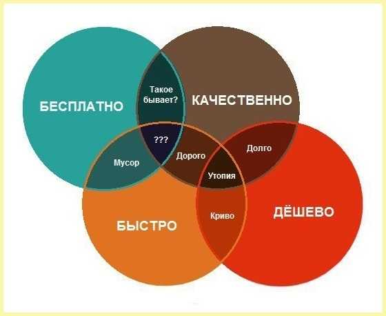
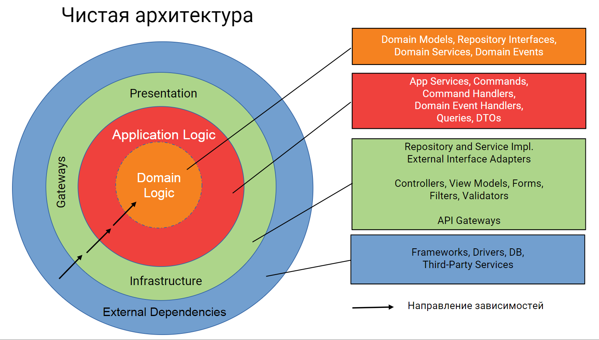

# The Clean Structure - Универсальная структура PHP-проекта на примере Laravel

К написанию этой статьи меня подтолкнуло изучение архитектурных подходов для [Vue.js-проектов](https://vue-faq.org/ru/development/project-structure.html).
А вдохновила, детально описанная методология [Feature-Sliced Design](https://feature-sliced.github.io/documentation/ru/).

К сожалению, PHP-сообществу очень не хватает подобных развернутых рекомендаций, да и вообще, каких-то общепризнанных стандартных подходов в структуре проекта. 

Моя статья это попытка обобщить информацию, полученную за много лет из десятков статей и книг, и сформировать универсальную структуру проекта основанную на принципах [Clean Architecture](https://blog.cleancoder.com/uncle-bob/2012/08/13/the-clean-architecture.html) и [модульного монолита](https://www.milanjovanovic.tech/blog/what-is-a-modular-monolith).

---cat---

```text
В статье будет много ссылок на другие статьи, книги или видео. 
Я специально даю ссылки, а не пытаюсь заново всё объяснить, тк, к сожалению, не возможно уместить всю информацию в одну статью.
Да и по факту, это будет просто пересказ другими словами.
Но со всей этой информацией рекомендую обязательно последовательно! ознакомиться.
Только после этого, в вашей голове начнут формироваться правильные нейронные связи. 
Всё по классике: отрицание, гнев, торг, принятие :))) 
```

----

## Побыстрее или подумать?
Любой из PHP-фреймворков имеет рекомендации по структуре папок, что и где надо создавать:
- [Laravel](https://laravel.com/docs/12.x/structure),
- [Symfony](https://symfony.com/doc/current/best_practices.html),
- [Yii](https://www.yiiframework.com/doc/guide/2.0/ru/start-workflow)
- [CakePHP](https://book.cakephp.org/5/en/intro/cakephp-folder-structure.html)
- [CodeIgniter](https://codeigniter.com/user_guide/concepts/structure.html)
- [Laminas](https://docs.laminas.dev/laminas-mvc/intro/#basic-application-structure)
- [Spiral](https://spiral.dev/docs/start-structure)

И это правильно, это очень сильно облегчает жизнь, обеспечивая низкий порог вхождения и быстрый старт разработки, особенно, [джунам и мидлам](https://kaiten.ru/blog/junior-middle-senior/).

### Так почему не устраивает разделение кода по типу файлов?
Всё дело в [Low Coupling и High Cohesion](https://medium.com/german-gorelkin/low-coupling-high-cohesion-d36369fb1be9) и нескольких других критериях, подробно описанных в статье [Как организовать структуру приложения](https://habr.com/ru/articles/873880/)

Конечно, базовую структуру легко переопределить под свои нужды. 
И вот здесь начинается самое сложное ([Как запустить MVP и не превратить его в технический долг](https://habr.com/ru/companies/oleg-bunin/articles/561524/)): 
- с одной стороны - каждый проект уникален и не понятно как применять стандарты, особенно на начальном этапе, 
- с другой стороны - качество архитектуры кода будет сильно зависеть от уровня разработчика, 
- а с третьей стороны - за прошедший год написана "тонна" кода по базовым правилам, кто заплатит за переделку?

Если в команде собраны эксперты, то они и так знают как надо правильно организовать структуру проекта. 
Но если в проекте большинство джунов и мидлов, то постоянно возникают вопросы: 
- Где создать этот файл? 
- Где разместить этот метод? 
- Где граница ответственности?
- и тп

И этот поток вопросов надо контролировать и ограничивать стандартами внутри проекта или команды.
Иначе уже через год проект превратиться в легаси из говнокода и лапшекода.

В комментах к статье [Как организовать структуру приложения](https://habr.com/ru/articles/873880/comments/#comment_27789172) Роман написал:
```
Структура папок - это просто инструмент, который помогает организовать код. 
Как карта местности. 
Она очень важна для навигации, но без качественного содержимого внутри теряет всякий смысл. 
Без понимания бизнес-процессов и здравого смысла даже идеальная структура папок превращается в свалку кода.
```

Это очень важный момент, нам программистам, всегда проще ориентироваться в четкой иерархической структуре, чем иметь два десятка файлов в одной директории.
Но, чтобы получилось что-то хорошее, сначала надо осмыслить:
- какие модули есть в программном проекте?
- как тесно они между собой связаны?
- есть ли планы по-дальнейшему развитию всего проекта? а по каждому модулю? 

И уже после ответа на эти вопросы надо начинать "рисовать карту местности".

### А это точно надо? Может это overhead?
Однозначного ответа на этот вопрос нет, как и «серебряной пули»! 
Выбор структуры проекта это не вопрос моды. 
Это стратегическое решение, которое должно базироваться на анализе конкретных бизнес‑требований, доступных ресурсов и сроков выполнения проекта!

Есть только путь в попытке найти баланс между трудозатратами, качеством и скоростью.



Но однозначно могу сказать, качественный и легко поддерживаемый проект не получится создать без разделения кода на зоны ответственности и написания тестов.
Зоны ответственности - это: "контроллеры", "модели", "валидация", "шаблоны" и множество других понятий, которые нужны только, чтобы по определенным правилам разделять написанный код. 
А тесты, это не только проверка функциональности и помощник при рефакторинге, но и лакмусовая бумажка, насколько правильно была выделена зона ответственности. 
Ведь хороший тест должен проверять результат только одного действия. Даже если это End-To-End тест.

Я не буду подробно останавливаться на том как правильно строить архитектуру проекта и что такое хороший тест. 
Об этом уже неоднократно писали:
- [Архитектура сложных веб-приложений. С примерами на Laravel](https://github.com/adelf/acwa_book_ru)
- [Принципы юнит-тестирования](https://youtu.be/LkrqqpkKIXE?si=cX_gRLKpxjM1Ih3e)
- [Блеск и нищета модели предметной области](https://habr.com/ru/companies/jugru/articles/503868/)
- [Плюсы и минусы написания запросов с ORM и на SQL](https://habr.com/ru/companies/beget/articles/890390/)
- [Валидация в приложении на PHP](https://habr.com/ru/articles/566394/)
- [Разные подходы к тестированию: в чем их суть и какой выбирать для своих проектов](https://habr.com/ru/companies/kuper/articles/665260/)
- [Грамотное ООП: организация надёжной бизнес-логики](https://www.youtube.com/watch?v=6tL1XOywgUc)

Пара "формальных" правил, когда не стоит "заморачиваться" и менять/усложнять базовые правила выбранного фреймворка:
- Когда у вас простой проект (кол-во контроллеров и моделей, условно!, 8-10 штук),
- Когда проект не собирается развиваться (сайт-визитка, лендинг, блог и тп).

А следует задуматься над структурой кода, когда проект:
- Имеет сложную логику (содержит десятки модулей и компонентов),
- Планируется долгосрочная поддержка и развитие функционала.

----

## Может уже есть готовые подходы?
Да, попытки были и не раз:
- [Laravel 8 Clean Architecture Example](https://niceprogrammer.com/laravel-8-clean-architecture-example/)
- [DDD, Hexagonal, Onion, Clean, CQRS… как я собрал всё это вместе](https://habr.com/ru/articles/427739/)
- [Domain Driven Design with Symfony: A Folder Structure](https://www.fabian-kleiser.de/blog/domain-driven-design-with-symfony-a-folder-structure/)
- [Organizing App Logic with the Clean Architecture](https://khalilstemmler.com/articles/software-design-architecture/organizing-app-logic/)
- [Модульный PHP монолит: рецепт приготовления](https://habr.com/ru/companies/ispring/articles/560074/)
- [Архитектура в Laravel. Как сделать код понятным и масштабируемым](https://habr.com/ru/articles/898584/)
- [Domain-Driven Design and Clean Architecture in PHP](https://medium.com/@pogulailo/domain-driven-design-and-clean-architecture-in-php-part-1-layers-and-structure-edcce57be42a)
- [Pragmatic implementation of the Clean Architecture with a fixed base layout and simple-to-follow rules and conventions](https://github.com/jkphl/clear-architecture)
- [DDD CQRS ADR PHP Symfony example](https://github.com/ferrius/ddd-cqrs-example)
- [LARAVEL + Clean Architecture](https://youtu.be/2ZqYhEfFyoc?si=qKSCAax1PWfjQA_-)
- [Как мы быстро распилили монолит, когда командам стало тесно](https://habr.com/ru/companies/skyeng/articles/545058/)
- [Практический пример декомпозиции монолитного PHP приложения](https://habr.com/ru/articles/796223/)

Но, к сожалению, это больше теоретические рассуждения: как сделать лучше, а не проработанные подходы, принципы, рекомендации или методологии. 
Нисколько не хочу принижать значимость этих работ. Я очень благодарен авторам за их труд. 
Все эти статьи помогли мне осознать, на что надо обращать внимание при создании архитектуры проекта.   

Отдельно хочу упомянуть статью [Упакуйте свой код правильно](https://habr.com/ru/articles/882964/), где очень подробно рассказано о структуре папок и есть ссылки на репозитории с примерами, но всё же что-то не то. 
Эта статья рассчитана на опытного разработчика, который знает разные подходы, но немного сомневается как правильнее сделать или не хватает аргументов для принятия решения.

Я же хочу подготовить набор подсказок и терминов или даже формальных правил, которые были бы понятны всем, а не только опытным ребятам. 
И этот набор был бы единообразен для разных команд и проектов, чтобы все могли говорить на "одном" языке.

### Контроль соблюдения стандарта
Еще один важный момент это не только принять и описать какие-то правила в команде, но и осуществлять контроль по их соблюдению.
Это ярко проявляется, когда в команду приходит новый сотрудник. 
Сначала ментор ему всё объясняет, показывает в WIKI где и что описано, а потом следит на Code Review, чтобы все эти правила соблюдались.
Когда текучка небольшая, то команда быстро усваивает и запоминает все правила, но даже в таком варианте бывают случайные ошибки.
Оптимальным вариантом для уменьшения "человеческого фактора" - является автоматизация таких проверок. 

К счастью, у нас для контроля есть тесты. Но не обычные, а архитектурные.
Инструментов много:
- [Deptrac](https://github.com/deptrac/deptrac)
- [PHP Architecture Tester](https://github.com/carlosas/phpat/)
- [PHPArkitect](https://github.com/phparkitect/arkitect)
- [PHPCleanArchitecture](https://github.com/Chetkov/php-clean-architecture)
- [Pest Architecture Testing](https://pestphp.com/docs/arch-testing) - надстройка над [PHPUnit Application Architecture Test](https://github.com/ta-tikoma/phpunit-architecture-test)
- [Modulite](https://vkcom.github.io/modulite/)
- [PhpMetrics](https://github.com/phpmetrics/PhpMetrics)

А вот хороших статей на эту тему мало:
- [Применение статических анализаторов архитектуры на примере гексагональной архитектуры](https://habr.com/ru/companies/docdoc/articles/856978/)
- [Чистая архитектура на PHP. Как её измерять и контролировать?](https://habr.com/ru/articles/504590/) и [PHPCleanArchitecture — Что нового?](https://habr.com/ru/articles/686236/)
- [Честные модули внутри PHP: теперь они существуют](https://habr.com/ru/companies/vk/articles/705998/)

----

## Основные термины и понятия
Как я писал выше: очень важно, чтобы понимать друг друга, говорить единообразно.
Приведу немного терминов:
- **Компонент** - минимально-достаточная часть продукта отвечающая за определенный функционал.
  Каждый компонент должен содержать "публичные" (доменные) интерфейсы, сущности или события, определяющие границы его использования - API.
  Можно вынести в самостоятельную composer-библиотеку
- **Модуль** - "взрослая" версия компонента - максимально самодостаточная часть продукта.
  Отличается от компонента тем, что умеет взаимодействовать с пользователем и предоставляет ему готовый бизнес функционал
- **UseCase** - "простая" реализация варианта поведения пользователя (что именно хочет сделать пользователь)
- **Interactor** - более глобальный уровень для реализации поведения пользователя 
- **DTO** - упрощенно, это "типизированный ассоциативный массив".
  **_Формальное правило когда применять_**: _private_ и _protected_ методы могу принимать и возвращать ассоциативный массив, но _public_ метод должен принимать и возвращать DTO
- **Event** - специализированный DTO, сообщающий другому модулю о возникшем событии и делится на:
  - **Уведомления** - Прошедшее событие (синхронное или асинхронное, много получателей)
  - **Запросы** - Получение данных (только синхронное, только один получатель)
  - **Команды** - Создание, Изменение и Удаление данных (только синхронное, много получателей)

Материалы для самостоятельного изучения:
- [CQRS на практике: Эволюция кода от Repository до CQRS](https://blog.byndyu.ru/2014/07/command-and-query-responsibility.html)
- [DTO vs POCO vs Value Object](https://habr.com/ru/articles/268371/)
- [Is it a DTO or a Value Object?](https://matthiasnoback.nl/2022/09/is-it-a-dto-or-a-value-object/)
- [Заблуждения Clean Architecture](https://habr.com/ru/companies/mobileup/articles/335382/)

----

## Чистая структура
### Новое — это хорошо забытое старое
Сейчас все говорят о DDD, Hexagonal Architecture, но давайте вернемся к истокам - модульности:
- [«Забытые» парадигмы программирования](https://habr.com/ru/articles/223253/)
- [Модульное программирование](https://otus.ru/journal/modulnoe-programmirovanie)
- [Сложность и модулярность две стороны одной медали. Влад Хононов](https://youtu.be/rH3u9DvOlPk?si=-JpbEAEqHB_MSx5_)
- [Эволюция архитектурных паттернов в бэкенд-разработке: от MVC к микросервисам](https://habr.com/ru/articles/904320/)
- [Проектирование ПО](https://gist.github.com/AleksandrKonst/ac6c11e684dd5d89a39e774ed04b309c)
- [Эволюция MVC до чистой архитектуры](https://rutube.ru/video/e81a2aa5f695833ea538347507109fec/)
- [Модули вместо микросервисов](https://habr.com/ru/articles/340898/)
- [Модульный монолит. Начало](https://habr.com/ru/companies/dododev/articles/650721/)
- [Денис Цветцих. Модульный монолит вместо микросервисов](https://rutube.ru/video/104ac9a446827b3a41bf3bfb63f67642)
- [Modular Monolith Architecture](https://abp.io/architecture/modular-monolith)

Почему именно модульность? 
Потому что всё остальное - это частные случаи модуля, попытки формализовать правила для определения зоны ответственности кода.
За годы изучения, у меня сформировалось свое понимание: как надо делать? 
И я называю свой подход: "Чистая структура" (The Clean Structure)
Фактически это та же группировка по типу файлов, только обернутая в модульность и разделенная по архитектурным слоям. 

### Универсальная структура папок и набор "формальных" правил: что и за что отвечает, и в какой папке создается файл?
- **/src**
  - **Core** - Ядро приложения, то от чего зависит работа большинства модулей, и код можно вынести в самостоятельную composer-библиотеку.
    Какие-то общепроектные события, исключения или обертки над фреймворком и vendor. Структура аналогична **компоненту**
  - **/%Название Модуля/Группы модулей%**
    - **/%Название Подмодуля/Компонента%**
      - /**Application** - Реализация любой бизнес-логики
        - /**Command** - Изменение данных во внешних системах. Например, **_БД_**
        - /**Dto** - Объекты для передачи из **UseCase** в **Command**, **Query**, **Query** и обратно
        - /**Factory** - Фабричные классы для создания Dto, Response, ValueObject
        - /**Responder** - Всё что требует специальной генерации контента вместо json для ответа пользователю
          - /**Template** - email-шаблоны, Excel/Word-шаблоны, сообщения в Telegram
          - **%Название.php%** - Какой-то генератор ответа либо выбор стратегии для генерации ответа. Например, **_CreateTaxExcelReport.php_**
        - /**Service** - Самодостаточный функционал
          - **%Название.php%** - Какая-то уникальная реализация логики. Например, **_калькулятор ABC-анализа_**
        - /**Query** - Получение данных из внешних систем. Например, БД
        - /**UseCase** - Варианты использования приложения, те обработка действий, которые выполняет пользователь
      - /**Domain** - Предметная область. Обычно все эти объекты доступны во вне модуля, как публичное API модуля (Контракт) 
        - /**Dto** - Объекты для передачи из **Infrastructure** и **Presentation** в **Application** и обратно
        - /**Event** - Дополнительные действия/уведомления, возникающие в ходе выполнения **UseCase**. Частный случай Dto
        - /**Exception** - Исключительные сообщения во вне об ошибке в **Application**
        - /**Entity** - Dto для описания структуры таблицы, используется в **Command** для создания записи в БД или требуется для ORM
        - /**Request** - "Входящие" Dto в **Controller** и **Console**
        - /**Response** - "Исходящие" Dto в **Controller**
        - /**Validation** - Бизнес требования по валидации Dto
        - /**ValueObject** - [Узкоспециализированный DTO с валидацией](https://github.com/adelf/acwa_book_ru/blob/master/manuscript/6-validation.md#value-objects), часто с встроенной валидацией данных
        - %**Интерфейс**.php% - API (контракт) для взаимодействия между модулями или для инверсии зависимости между слоями модуля
      - /**Infrastructure** - Здесь собран функционал для реализации подхода [Anti-corruption layer](https://gist.github.com/AleksandrKonst/ac6c11e684dd5d89a39e774ed04b309c#4-%D0%BF%D1%80%D0%B5%D0%B4%D0%BE%D1%85%D1%80%D0%B0%D0%BD%D0%B8%D1%82%D0%B5%D0%BB%D1%8C%D0%BD%D1%8B%D0%B9-%D1%83%D1%80%D0%BE%D0%B2%D0%B5%D0%BD%D1%8C-anticorruption-layer) и [Framework Agnostic](https://telegra.ph/Framework-Agnostic-dlinoj-v-12-let-03-05)
        - /**Adapter** - Реализация интерфейсов из **Domain** для взаимодействия из **Application** с другими модулями/компонентами/vendor
        - /**%Название внешней библиотеки%** - Адаптеры, упрощающие взаимодействие с библиотеками из vendor. Пример, [SerializerDecorator](../backend/src/Core/Infrastructure/Symfony/SerializerDecorator.php)
      - /**Presentation** - Часть фреймворка для обеспечения запуска и завершения приложения, или точки входа и выхода в модуле
        - /**Config** - Конфигурационные файлы
          - Обертка над получением значений из env (https://laravel.su/docs/12.x/configuration#konfiguraciia-okruzeniia, https://laravel.su/docs/12.x/packages#resursy)
          - Управление зависимостями. Реализация паттернов "Dependency injection" и "Service Container" https://laravel.su/docs/12.x/container и https://laravel.su/docs/12.x/providers
        - /**Console** - Крон-скрипты, Демоны и другие команды, вызываемые из консоли (https://laravel.su/docs/12.x/artisan#napisanie-komand)
        - /**Http** - Запросы по http-протоколу (REST API, SOAP API или обычные HTML-страницы)
          - /**Controller** - https://laravel.su/docs/12.x/controllers
          - /**Middleware** - https://laravel.su/docs/12.x/middleware
          - /**View** - Html-шаблоны
        - /**Listener** - Обработчики событий (https://laravel.su/docs/12.x/events#opredelenie-slusatelei)
- /**tests**
  - /**Architecture** - Архитектурные тесты 
  - /**Stub** - Все что требуется для выполнения тестов. Например, **_универсальный fake-jwt_**
  - /**Suite** - [Набор тестов](https://testengineer.ru/test-suite) для нашего приложения
    - /**%Название Модуля%**
      - /**%Название Подмодуля/Компонента%**
        - ...
  - **TestCase.php** - Абстрактный родитель-обертка над фреймворком

Предложенный вариант, это "максимальная" сложность одного модуля.
В реальной жизни, не требуется создавать все папки сразу.

### Примеры реализации
Я создал [демо-проект](https://github.com/vendelev/Clean-Architecture-Laravel-Demo-Structure), чтобы на почти реальных примерах показать универсальность предложенной структуры папок.

#### Есть задача: проверять, что ресурс доступен (аля ping, только через HTTP)
Те каждую секунду будет HTTP запрос.
Для реализации этого функционала будет достаточно создать один файл:
- [Presentation/Http/Controller/PingController](../backend/src/System/HealthCheck/Presentation/Http/Controller/PingController.php)

#### А теперь давайте подумаем, какая будет структура для задачи "Проверки доступности и работоспособности DB в проекте" 
К примеру, такая проверка нужна 1 раз в минуту.
Тут уже потребуется более сложная логика и для Laravel будет вот такая [структура](../backend/src/System/HealthCheck):
- Application/Command/CheckDbWriter.php
- Application/Query/CheckDbReader.php
- Application/UseCase/DbHealthUseCase.php
- Domain/Entity/HealthCheck.php
- Presentation/Config/HealthCheckServiceProvider
- Presentation/Listener/HealthChecker.php

На первый взгляд, кажется, что вся это вложенность - прям очень сильный оверхед, почему не создать 5 файлов в одной папке?  
Но через один-два месяца, может потребоваться проверять доступность для Redis, RabbitMQ или ClickHouse.

В итоге, будут десятки файлов в одной папке и захочется их сгруппировать.
Как вариант, можно разделить код через создание подмодулей:
- /DbChecker
  - DbCheckerProvider.php
  - DbCheckerListener.php
  - DbHealthUseCase.php
  - CheckDbReader.php
  - CheckDbWriter.php
  - HealthCheckEntity.php
- /RedisChecker
- /ClickHouseChecker

К сожалению, при такой группировке начинают размываться границы между архитектурными слоями внутри модуля. 
В данном примере это не критично. НО:
1. Если будет не опытный разраб, реализация бизнес логики может оказаться в контроллере, вплоть до запросов к БД. И это придется отслеживать на уровне Code Review.
2. Если модуль усложняется, допустим это вывод аналитической информации со сложными фильтрами, экспортом и тп, то выделение подмодулей становиться крайне сложным. 
Будет очень много взаимосвязей между модулями и вместо упрощения получится сильная связанность. 

----

## Зависимости и контроль
Напомню общий принцип инверсии зависимостей "Чистой архитектуры"


Почему надо контролировать зависимости между слоями и какие способы взаимодействия между модулями (контекстами) существуют хорошо освещено в статье [Связывая Контексты: Руководство по Эффективному Взаимодействию](https://habr.com/ru/articles/892250/)

### Для себя я сформулировал следующие упрощенные правила.

1. Не усложняй и так всё сложно! 
2. Между слоями существуют [следующие зависимости](../backend/tests/Architecture/CleanArchitectureTest.php):
   - **Presentation**, тк это часть фреймворка, может использовать **Infrastructure**, **Application** и **Domain** (и свой и чужой)
   - **Infrastructure** может использовать только **Application** и **Domain** (и свой и чужой)
   - **Application** может использовать **Domain** (желательно, только свой)
   - **Domain** может использовать только **Domain** (и свой и чужой)
3. **UseCase** - не может использовать другой **UseCase**, тк теряется "простота". Но может агрегировать в себя **Query** и **Command**
4. **Interactor** - не должен использовать другой **Interactor**, тк, скорее всего, не правильно декомпозированы UseCase. Но может агрегировать в себя **Query**, **Command** и **UseCase**
5. **Модуль** может использовать **компоненты** используя подход "Anticorruption layer": взаимодействие происходит через Интерфейсы в **Domain** в компоненте

Желательно, чтобы модуль не имел зависимостей от другого модуля.
Если такое потребовалось, скорее всего не правильно декомпозирован контекст и стоит подумать о создании отдельного компонента.
Но, когда очень надо, то можно воспользоваться схемой "модуль -> компонент"

Еще один вариант организовать взаимодействие между модулями и компонентами - **доменные события** (/Domain/Event).

### Обязательность интерфейсов
- В рамках одного модуля не обязательно создавать Интерфейс, если существует только одна реализация
- Интерфейс создается всегда, если надо что-то вызвать из другого модуля/компонента

### Тесты
Тесты пишутся всегда! Даже когда их некогда писать.

Один из способов проверить всё и сразу - это End-To-End тесты.
Такой вид теста охватывает почти весь код, но очень сложен в разработке и поддержке.

- End-To-End тесты лучше всего подходят для проверки связанной работоспособности всех кусочков системы и проверяют, в основном, положительные кейсы.
- Unit и Integration тесты лучше использовать для более детальной проверки, особенно негативных случаев.


----

## PS
Приглашаю всех желающих к обсуждению и созданию методологии или набора методик/практик для стандартизации структуры проекта.
Давайте создадим коллекцию примеров правильной структуры проекта для разных фреймворков. 
Если не мы сами, то кто за нас это сделает? 

----

## Ещё немного полезных ссылок
- [Строим систему доменных событий в модульном монолите](https://habr.com/ru/companies/ispring/articles/569648/)
- [The Software Architecture Chronicles](https://herbertograca.com/2017/07/03/the-software-architecture-chronicles/)
- [Action-Domain-Responder](https://herbertograca.com/2018/09/03/action-domain-responder/)
- [Action-Domain-Responder — доработка MVC под задачи веба](https://habr.com/ru/articles/260769/)
- [Series of posts about Software Architecture](https://herbertograca.com/tag/software-architecture/)
- [Clean Architecture Manifest](https://github.com/ImangazalievM/CleanArchitectureManifest/blob/master/README-RU.md)
- Clean architecture series: 
  - [часть 1](https://dev.to/pereiren/clean-architecture-series-part-1-m64), 
  - [часть 2](https://dev.to/pereiren/clean-architecture-series-part-2-49db), 
  - [часть 3](https://dev.to/pereiren/clean-architecture-series-part-3-2795)
- [SOLID: Low Coupling против читабельности](https://habr.com/ru/articles/871412/)