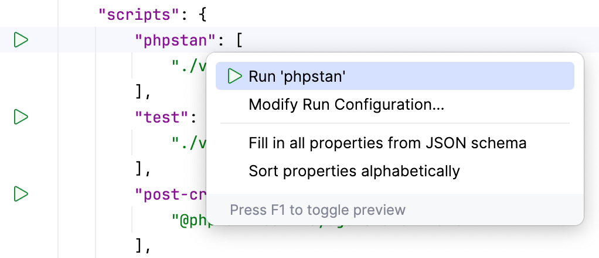
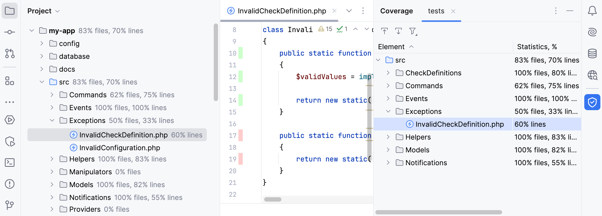
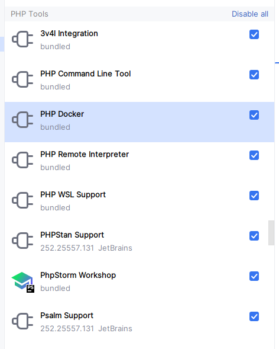

# Чистый код: Настройка PHPStorm

Если вы еще не читали книгу "Чистый код. Создание, анализ и рефакторинг", то самое время это сделать.
Или можно ознакомится с выжимкой в статьях:
- [Прочитал «Чистый код», чтобы вам не пришлось](https://habr.com/ru/articles/922424/)
- [Чистый код — практический подход](https://habr.com/ru/companies/otus/articles/682922/)
- [Чистый код (Clean Code)](https://technical-excellence.ru/wiki/CleanCode.html)

---
В прошлой статье [Чистая структура](https://habr.com/ru/articles/905008/) я рассказал о своем понимании хорошей структуры PHP-проекта.
Но хорошая структура проекта - это только половина дела, другая половина - чистота вашего кода, залог здоровья вашего проекта в будущем.<br>
Следить за соблюдением всех требований Code Style, проверять сигнатуры методов, процент покрытия кода и многое другое во время Code Review - утомительно и провоцирует постоянные конфликты в команде. <br>
Намного удобнее все проверки проводить автоматически и единообразно для всех и не только в CI/CD, но и локально - в PHPStorm.<br>
С роботом сложно спорить. :)<br>

## Автоматизируй это
Прежде всего нужно настроить максимально простой и удобный запуск проверок нашего кода.

### Composer scripts
Сценарии Composer — удобный способ определения и выполнения команд.
- [Секция scripts](https://getcomposer.org/doc/articles/scripts.md) внутри файла **_composer.json_** позволяет описывать произвольные команды.
- [How To Automate Projects Using Composer Scripts](https://matthewsetter.com/series/tooling/composer/automation-scripts/)
- [Composer Scripts: Как автоматизировать рутину](https://www.youtube.com/watch?v=2lEXM4C3IiY)

Основной минус этого метода - надо зайти в контейнер с PHP и там выполнить команду ```composer bla-bla```. <br>
И тут нам на помощь приходит PHPStorm: после [настройки](https://www.jetbrains.com/help/phpstorm/using-the-composer-dependency-manager.html#run-composer-script), запуск команды проходит по кнопке в интерфейсе.


### Makefile
Чтобы каждый раз не заходить в контейнер, кроме PHPStorm, можно использовать "обертку" в виде Makefile.
Утилита **make** широко распространена и включена во множество дистрибутивов.
- [Make files not war: что такое утилита GNU make](https://tproger.ru/translations/make-files-best-practices)
- [Makefile для самых маленьких](https://habr.com/ru/articles/155201/)
- [Docker Compose: упрощение работы с использованием Makefile](https://habr.com/ru/companies/ruvds/articles/486682/)

Современный аналог Makefile - [Taskfile](https://taskfile.dev/).

В [проекте-примере](https://github.com/clean-structure/Clean-Structure-Symfony-Example) я использую оба подхода: 
- для работы с Git и Docker использую Makefile, 
- через PHPStorm запускаю команды из Composer scripts.

## Анализируй это
[Линтеры](https://practicum.yandex.ru/blog/chto-takoe-linter-v-programmirovanii/), в мире PHP больше известны под названием [статические анализаторы кода](https://kitp.netlify.app/docs/isrpo/lections/l_06/), помогают:
- Обучать новых членов команды принятым стандартам
- Контролировать общее качество кода
- Уменьшить вероятность возникновения критичных ошибок
- Автоматизировать проверки на этапе CI/CD

### PHPStorm
В PHPStorm существует встроенный статический анализатор, но, к сожалению, его возможности ограничены. В дополнение к нему, рекомендую поставить плагин [Php Inspections (EA Extended)](https://plugins.jetbrains.com/plugin/7622-php-inspections-ea-extended-) - в realtime подсвечивает ошибки и дает полезные советы.

### PHP_CodeSniffer / PHP CS Fixer
Помогают следить за стилистикой кода и, по возможности, автоматически исправляют ошибки:
- https://github.com/PHPCSStandards/PHP_CodeSniffer/
- https://github.com/PHP-CS-Fixer/PHP-CS-Fixer

В PHPStorm можно настроить интеграцию и тогда ошибки будет подсвечиваться с realtime:
- https://www.jetbrains.com/help/phpstorm/using-php-code-sniffer.html
- https://www.jetbrains.com/help/phpstorm/using-php-cs-fixer.html

Есть более универсальный вариант - [easy-coding-standard](https://github.com/easy-coding-standard/easy-coding-standard)
Объединяет PHP Code Fixer, Code Sniffer, [Slevomat](https://github.com/slevomat/coding-standard) и [Simplify](https://github.com/symplify/coding-standard), но к сожалению не имеет интеграции с PHPStorm.

Исторически сложилось, что я использую Code Sniffer. Публикую [набор правил](https://github.com/clean-structure/Clean-Structure-Symfony-Example/blob/master/backend/phpcs.xml.dist), которые я использую почти в каждом проекте.

### PHPStan / Psalm
Эти статические анализаторы проверяют типизацию в коде:
- https://phpstan.org/
- https://psalm.dev/
- [Статический анализ PHP-кода на примере PHPStan, Phan и Psalm](https://habr.com/ru/companies/badoo/articles/426605/)
- [PHPStan — инструкция по применению](https://sergeyem.ru/blog/129)

В PHPStorm также можно настроить проверки в realtime:
- https://www.jetbrains.com/help/phpstorm/using-phpstan.html
- https://www.jetbrains.com/help/phpstorm/using-psalm.html

Мне больше нравится PHPStan, тк для него много [плагинов](https://phpstan.org/user-guide/extension-library), например:
- [phpstan/phpstan-phpunit](https://github.com/phpstan/phpstan-phpunit)
- [phpstan/phpstan-strict-rules](https://github.com/phpstan/phpstan-strict-rules)

### PHP Mess Detector
Этот статический анализатор выявляет потенциальные проблемы в коде, определяет неоптимальные и усложнённые места и многое другое
- https://phpmd.org/rules/index.html
- https://www.jetbrains.com/help/phpstorm/using-php-mess-detector.html

К сожалению, на момент написания статьи, работа над поддержкой PHP 8.4 [не закончена](https://github.com/phpmd/phpmd/issues/1219). <br>
Но если используете более старые версии, крайне рекомендую этот инструмент.

### Rector
Очень [полезная утилита](https://getrector.com/) - проверяет соответствие кода возможностям PHP и фремворков (более 700 правил). Так же умеет исправлять найденные ошибки.
- [Апгрейд и рефакторинг PHP-проектов](https://habr.com/ru/companies/oleg-bunin/articles/720216/)
- [PhpStorm 2022.2: Rector Support](https://blog.jetbrains.com/phpstorm/2022/08/phpstorm-2022-2-is-now-available/#rector-support)

Мой [вариант настроек](https://github.com/clean-structure/Clean-Structure-Symfony-Example/blob/master/backend/rector.php) для Rector.

### Symfony
Каждый фреймворк имеет свои команды валидации, для Symfony это:
- **_bin/console cache:clear_** - Не только удаляет кеш, но и стоит новый. Позволяет проверять корректность DI
- **_bin/console lint:container_** - Проверка конфигурации сервис-контейнеров
- **_bin/console lint:twig --format=github_** - Проверка синтаксических ошибок в шаблонах
- **_bin/console lint:yaml . --format=github_** - Проверка файлов конфигурации

Хорошие bundle'ы так же имеют команды для проверки, например:
- **_bin/console doctrine:schema:validate_** - Проверка соответствия схемы в БД и файлов с mapping-ом

## Проверяй это
Чистый код - это не только ~~ценный мех~~ CodeStyle и TypeHint, но ещё и автоматические тесты.

### PHPUnit + Coverage
Тесты надо писать всегда! <br>
Без тестов - каждое обновление composer-зависимостей будет требовать полное [регрессионное тестирование](https://practicum.yandex.ru/blog/chto-takoe-regressionnoe-testirovanie/) всего проекта.<br>
Без тестов - проведение рефакторинга так же потребует проведения регрессионного тестирования.

Но тесты нужны не только для проверки функционала. <br>
Их можно и нужно использовать для получения метрик качества кода:

- [Run tests with code coverage](https://www.jetbrains.com/help/phpstorm/code-coverage.html)
- [Улучшения покрытия PHP кода](https://habr.com/ru/companies/oleg-bunin/articles/519080)
- [Анализ покрытия кода](https://phpunit-documentation-russian.readthedocs.io/ru/latest/code-coverage-analysis.html)

### Composer
Много лет назад, это был просто пакетный менеджер, но сейчас Composer - полноценный помощник.

Команды и плагины, которые следят и проверяют вместо Вас:
- **_composer normalize --diff_** - [Плагин](https://github.com/ergebnis/composer-normalize) помогает стандартизировать структуру файла composer.json. С флагом "--dry-run" - делает только проверку
- **_composer bump_** - Команда прописывает в composer.json установленную версию пакета, это упрощает проведение Code Review. С флагом "--dry-run" - делает только проверку
- **_composer validate_** - Проверяет схему composer.json и синхронизацию с composer.lock
- **_vendor/bin/composer-dependency-analyser_** - [Инструмент](https://github.com/shipmonk-rnd/composer-dependency-analyser) помогает выявлять скрытые зависимости в проекте. Подсказывает, что используются зависимости, которые установлены не на прямую в composer.json, но требует [настройки](https://github.com/clean-structure/Clean-Structure-Symfony-Example/blob/master/backend/composer-dependency-analyser.php)
- **_composer outdated --strict --sort-by-age_** - Команда выводит список всех устаревших пакетов. Это помогает поддерживать зависимости в актуальном состоянии

## Помогаторы
### Editorconfig
[EditorConfig — Одни Настройки для всех Редакторов/IDE](https://habr.com/ru/articles/220131) - статья старая, но всё еще актуальная.
А добавить файл с [общими настройками](https://editorconfig.org/) редактора - простая задача.

В одном из проектов, где я принимал участие, ТехЛид пошел ещё дальше: сделал [экспорт настроек](https://www.jetbrains.com/help/phpstorm/editorconfig.html) из PHPStorm (там очень много всего) и запушил ".editorconfig" в Git. 
С тех пор наш код стал однообразен до безобразия. :)

В проекте-примере я использовал базовый [.editorconfig](https://github.com/clean-structure/Clean-Structure-Symfony-Example/blob/master/.editorconfig) на весь проект.

### PHPStorm
Эти плагины существенно ускоряют написание кода и, одновременно, уменьшают количество опечаток:
- [deep-assoc-completion](https://plugins.jetbrains.com/plugin/9927-deep-assoc-completion) - автодополнение ключей массивов
- [PHP Annotations](https://plugins.jetbrains.com/plugin/7320-php-annotations) - Подсказки для аннотаций и атрибутов
- [Docker](https://plugins.jetbrains.com/plugin/7724-docker) - У меня всё крутиться в Докере и этот плагин удобный интерфейс для работы с запущенными контейнерами
- [Makefile](https://plugins.jetbrains.com/plugin/9333-makefile-language) - Подсветка синтаксиса и запуск команд
- [Taskfile](https://plugins.jetbrains.com/plugin/17058-taskfile) - Подсветка синтаксиса и запуск команд
- [Markdown](https://plugins.jetbrains.com/plugin/7793-markdown) - Я сторонник [Docs-as-Code](https://apptractor.ru/info/articles/docs-as-code.html). Этот плагин - упрощенный WYSIWYG
- [.ignore](https://plugins.jetbrains.com/plugin/7495--ignore) - Подсветка синтаксиса для .gitignore и подобных файлов
- [Developer Tools](https://plugins.jetbrains.com/plugin/21904-developer-tools) - Куча мелких утилит, например, Base64 декодер.
- [Rector Support](https://plugins.jetbrains.com/plugin/19718-rector-support) - Запуск Rector

И проверьте, что вот эти плагины включены


Знаю, что есть разработчики предпочитающие использовать VSCode, приглашаю их поделиться в комментах своими подборками плагинов и практиками работы с PHP-проектами.

## PS
Полный список команд с запуском проверок можно посмотреть в [composer.json](https://github.com/clean-structure/Clean-Structure-Symfony-Example/blob/master/backend/composer.json#L110)

Полезные ссылки:
- [Сравнение анализаторов php-кода на примере разных веб-проектов](https://habr.com/ru/articles/576074/)
- [Статический анализ кода PHP](https://habr.com/ru/companies/otus/articles/676126/)
- [Базовый набор инструментов PHP разработчика](https://www.youtube.com/watch?v=rU799SHViFc)

А какие вы используете инструменты для проверки качества вашего кода?


